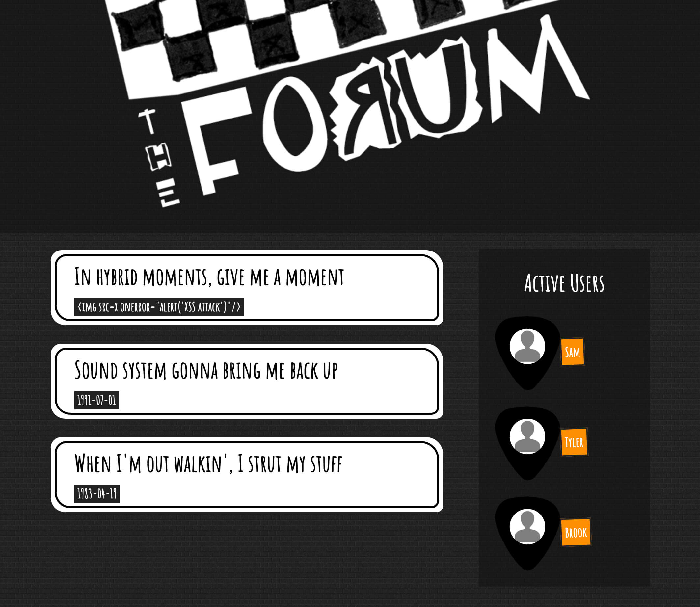

# A basic forum web app implemented in JavaScript with Babel, Gulp, Browserify,  and other awesome technologies

# Installing

1. Clone the repo
2. `npm install -g gulp` to install Gulp globally.
3. `npm install` to resolve project dependencies.

# Using

Run `npm start` from the command line and you are good to go!

# License
MIT
